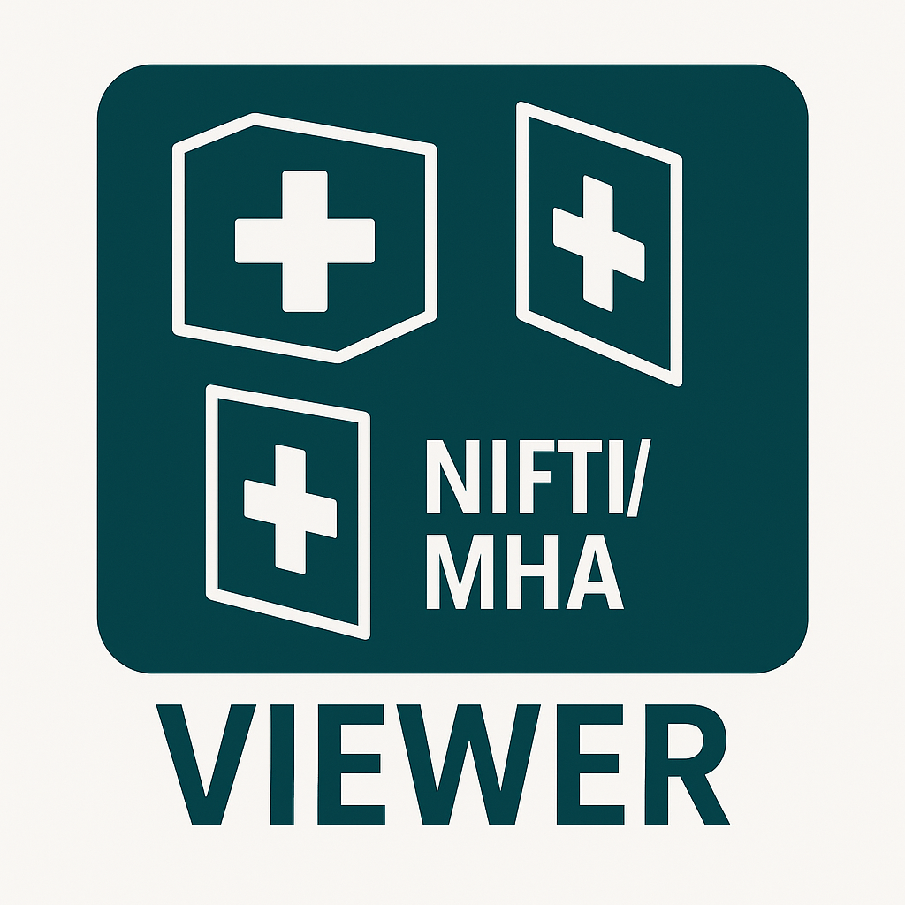

# Medical Image Viewer

A versatile and user-friendly medical image viewer for NIfTI (.nii, .nii.gz) and MetaImage (.mha, .mhd) formats, built with PySide6. It provides a comprehensive set of tools for clinical research and data analysis.



## Features

-   **Multiple Formats Support**: Natively handles NIfTI (.nii, .nii.gz) and MetaImage (.mha, .mhd) files.
-   **Tri-planar View**: Simultaneously displays Axial, Sagittal, and Coronal views for comprehensive 3D data analysis.
-   **Label Overlay**: Load and overlay segmentation masks on top of the base image.
-   **Customizable Label Colors**: Easily assign and change colors for different labels to enhance visualization.
-   **Interactive Navigation**:
    -   Scroll through slices using the mouse wheel or sliders.
    -   Zoom in/out with `Ctrl + Mouse Wheel`.
    -   Pan the view by right-clicking and dragging.
-   **Adjustable Overlay Transparency**: Fine-tune the alpha value of the label overlay for optimal clarity.
-   **Volume Saving**: Export the image, label, or blended overlay in NIfTI or MetaImage formats. Use `Ctrl+Shift+S` to open the save menu quickly.
-   **Screenshot**: Save the current view as a PNG image.
-   **Trilingual Interface**: Supports English, Chinese, and French languages with dynamic switching capability.
-   **Command-line Interface**: Load images and labels directly from the command line for faster workflow.

## Installation

1.  Clone the repository:
    ```bash
    git clone https://github.com/StevenChen16/medical_image_viewer.git
    cd medical_image_viewer
    ```

2.  Install the required dependencies:
    ```bash
    pip install -r requirements.txt
    ```

## Usage

Run the viewer from the command line:

```bash
python nifti_viewer.py
```

You can also specify image and label files to open at startup:

```bash
python nifti_viewer.py -i /path/to/your/image.nii.gz -l /path/to/your/labels.nii.gz
```

### Command-line Arguments

-   `-i`, `--image`: Path to the medical image file.
-   `-l`, `--labels`: Path to the label mask file.
-   `-o`, `--output`: Default path to save screenshots.

For more options, run:
```bash
python nifti_viewer.py --help
```

## Dependencies

-   PySide6
-   NumPy
-   Nibabel
-   SimpleITK
-   Pillow
-   Matplotlib

See `requirements.txt` for specific versions.
